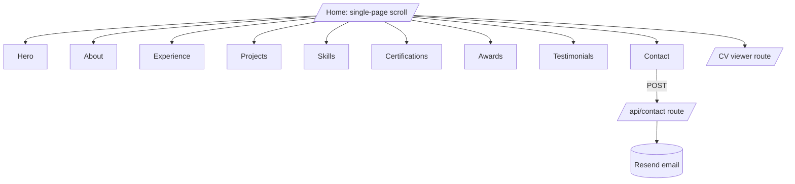

# Emmanuel Ozioma — Developer Portfolio

## 1. Stack

- **Framework**: Next.js 15 (App Router) + TypeScript + React 19
- **Styling**: Tailwind CSS v4, dark mode via `next-themes`
- **UI primitives**: shadcn/ui (Button, Card, Badge, Tabs, Tooltip)
- **Icons**: lucide-react + simple-icons (for tech logos)
- **Animations**: framer-motion (subtle reveals, hover states)
- **Forms**: react-hook-form + zod, posted to a Next.js Route Handler that forwards to Resend (email) — works on Vercel; for GitHub Pages mirror, falls back to a `mailto:` link
- **SEO**: `next/metadata`, OpenGraph image generated via `next/og`, sitemap, robots.txt
- **Analytics**: Vercel Analytics (free tier)
- **Hosting**: Source on GitHub (`emmanuel-ozioma/portfolio`), production on Vercel with a custom domain
- **Tooling**: ESLint, Prettier, Husky pre-commit, GitHub Actions for typecheck on PR

## 2. Folder Structure

```text
portfolio/
  app/
    layout.tsx
    page.tsx                # single-page scroll
    cv/page.tsx             # CV viewer (PDF embed + download)
    api/contact/route.ts    # POST handler (Resend)
    opengraph-image.tsx     # auto-generated OG card
    sitemap.ts
    robots.ts
  components/
    sections/               # Hero, About, Experience, Projects, Skills, Certs, Awards, Testimonials, Contact
    ui/                     # shadcn primitives
    nav/Navbar.tsx, Footer.tsx, ThemeToggle.tsx
  data/
    profile.ts              # name, headline, links
    experience.ts           # roles + sub-roles
    projects.ts             # featured projects
    skills.ts               # grouped by category
    certifications.ts
    awards.ts
    testimonials.ts
  public/
    cv/emmanuel-ozioma-cv.pdf
    images/                 # avatar, OG fallback, project shots
  lib/utils.ts
  tailwind.config.ts
  README.md
```

## 3. Section-by-Section Content (mapped to your CV + LinkedIn)

- **Hero**: "Emmanuel Ozioma — Software Engineer @ Goldman Sachs". Tagline drawn from your About: ~3 years building scalable backends and full-stack apps in finance. CTAs: View CV, Email me, GitHub, LinkedIn, YouTube.
- **About**: ~120-word version of your LinkedIn About; emphasises backend depth, fintech experience at Shell, GenAI tech-lead, teaching via OzyCodes.
- **Experience** (timeline cards):
  - Goldman Sachs — Software Engineer II, Compliance (Aug 2025–present): Spring Boot + React platform serving 5+ business units, EKS HA, latency wins (>5 min → <10 s), 99.9% uptime, 30% faster incident resolution.
  - Shell — Associate Software Engineer (Sept 2022–April 2025), three sub-roles:
    - Backend Developer, Downstream Exchange — fintech trading, $25M+ benefits, 4B+ barrels, 100% test coverage on new code, +25% SonarQube. Stack: C# .NET Core, ASP.NET Core, RabbitMQ, Redis, Docker, K8s, Azure DevOps.
    - Deployment Manager, Downstream Pricing — 15+ production deploys.
    - Tech Lead, Shell Intellytics — led team of 5 on GenAI app, $4k/month productivity gain, 5-star honours.
  - The Intrapreneurs Club — Accelerator Programme (May–Sept 2021).
- **Featured Projects**:
  - **OzyCodes (YouTube)** — programming tutorials, link + embedded latest videos via YouTube oEmbed.
  - **Shell Intellytics (case study)** — anonymised summary of the GenAI productivity app.
  - 1–2 placeholder slots for personal projects you want to add (I'll wire up the data shape so adding one = adding an object to `data/projects.ts`).
- **Skills** (grouped chips):
  - Languages: Java, C#, .NET, Kotlin, Python, JavaScript/TypeScript, SQL
  - Backend: Spring Boot, Hibernate, ASP.NET Core, REST, Microservices, Multi-threading
  - Frontend: React, Next.js
  - Messaging: Kafka, RabbitMQ, Redis
  - Data: MS SQL, PostgreSQL, MongoDB, DB2
  - Cloud/DevOps: AWS EKS, Docker, Kubernetes, Azure DevOps, CI/CD, Git
- **Certifications**: Google Cloud (Spring Boot Microservices), Shell GenAI Developer, IBM AI Developer (in progress), Flutter Path (LinkedIn Learning) — each as a card with verify links.
- **Awards**: 2x 5-Star Honours (Shell), STAN/ExxonMobil Science Fair (state winner, national runner-up).
- **Testimonials**: Tim Hughes and Marcial Garza quotes from LinkedIn, with link-back to their profiles.
- **Contact**: Form (name, email, message) → Route Handler → Resend → your inbox; plus direct email `o.emmanuelozioma@gmail.com` and social links.
- **Footer**: © Emmanuel Ozioma, location (Salford/Birmingham), built with Next.js link to source repo.

## 4. Information Architecture



## 5. Visual Direction

- Modern, minimal, dark-first with light toggle.
- Mono accent (e.g. emerald or indigo) on a neutral base.
- Section anchors in the navbar; sticky on desktop, hamburger on mobile.
- Subtle scroll-reveal via framer-motion; no heavy parallax.
- Strong typography (Geist or Inter for body, JetBrains Mono for accents).

## 6. Deployment

- GitHub repo: `emmanuel-ozioma/portfolio` (public, MIT licensed).
- Vercel project linked to `main` for production, all branches for previews.
- Custom domain: recommend buying `emmanuelozioma.dev` or `.com` (~£10/yr at Cloudflare/Namecheap). I'll output the DNS records to add.
- Env vars: `RESEND_API_KEY`, `CONTACT_TO_EMAIL`.

## 7. Things I'll Need from You During Build

- A headshot (square, ~800x800) — optional; I can use initials placeholder.
- Any personal projects you want featured (repo links + 1-line descriptions).
- Confirmation on accent colour and final domain name.
- Resend account (free) for the contact form, or I can use a `mailto:` fallback for v1.

## 8. Out of Scope for v1

- Blog/MDX writing system (can add later).
- CMS — content lives in typed `data/*.ts` files for now.
- i18n.
